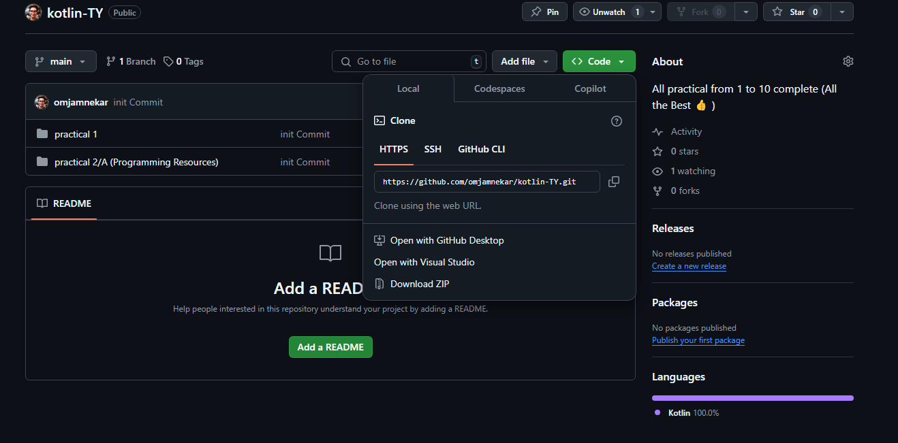
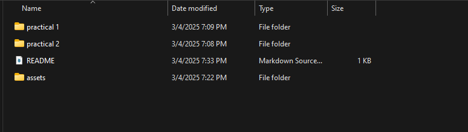
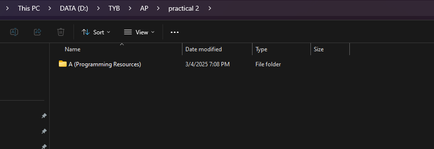
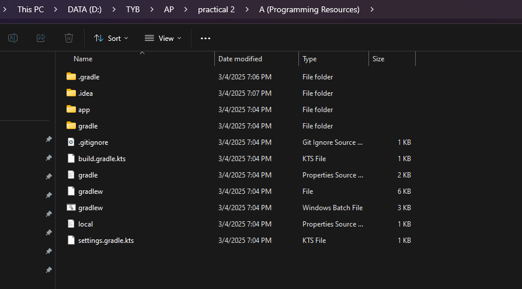
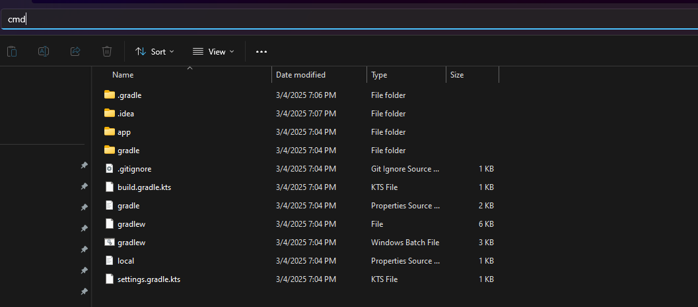
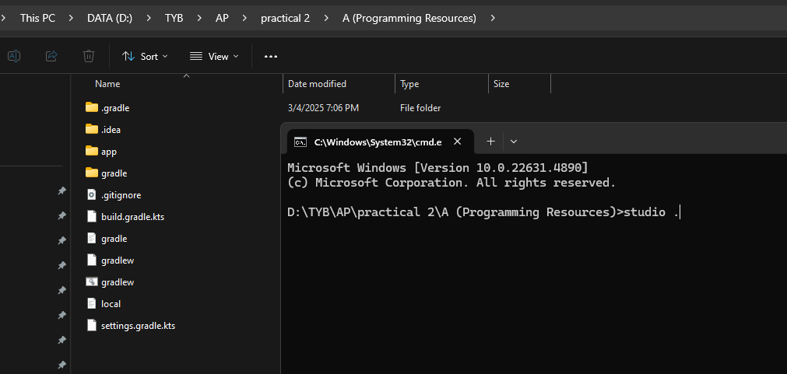

# All the Best for Practical Exam

To access Practical download zip file via CODE > DOWNLOAD ZIP

## Step 1: Open any folder of practical

## Step 2: Open any folder of program

## Step 3: Open CMD in the directory and use `studio .`

(This will open the project in Android Studio)

## Step 4: Run the program with the Run button

(Select an appropriate Simulator)
